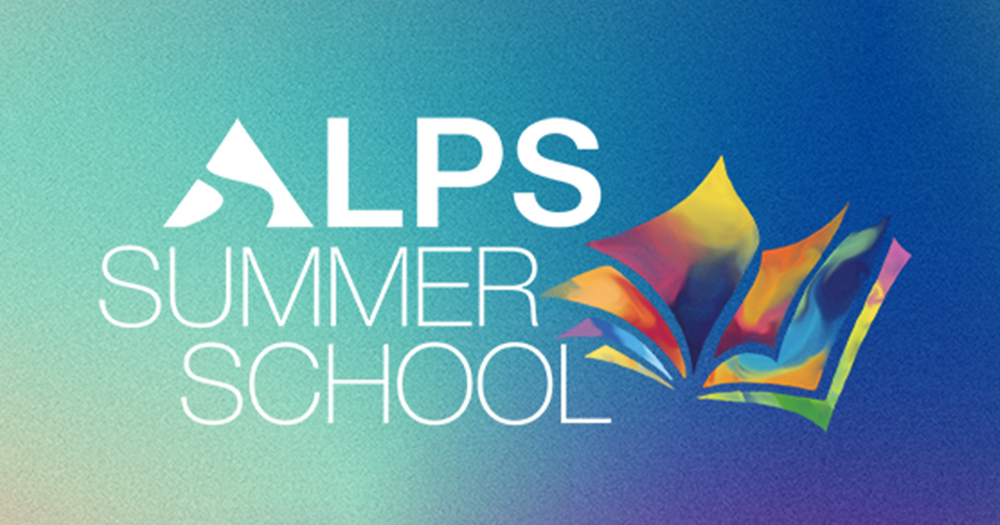

# summerschool.alps.foundation

Website for the ALPS Summer School — built with [Astro](https://astro.build/).

## Open Graph image

Default social preview (`og:image`, Twitter `summary_large_image`). Defined in [`src/layouts/Layout.astro`](src/layouts/Layout.astro) with `image = '/assets/opengraph.jpg'`.

| | |
| :--- | :--- |
| **Repo file** | [`public/assets/opengraph.jpg`](public/assets/opengraph.jpg) |
| **Deployed URL** | https://summerschool.alps.foundation/assets/opengraph.jpg |



## Project structure

```text
/
├── content/           # section copy (plain text)
├── public/
│   ├── assets/        # images, favicon, opengraph.jpg
│   └── fonts/
├── src/
│   ├── components/    # page sections (Hero, Program, …)
│   ├── layouts/
│   │   └── Layout.astro
│   ├── pages/
│   │   └── index.astro
│   └── styles/
├── astro.config.mjs
├── wrangler.jsonc
└── package.json
```

## Commands

All commands are run from the root of the project, from a terminal:

| Command                   | Action                                           |
| :------------------------ | :----------------------------------------------- |
| `pnpm install`             | Installs dependencies                            |
| `pnpm dev`             | Starts local dev server at `localhost:4321`      |
| `pnpm build`           | Build your production site to `./dist/`          |
| `pnpm preview`         | Preview your build locally, before deploying     |
| `pnpm astro ...`       | Run CLI commands like `astro add`, `astro check` |
| `pnpm astro -- --help` | Get help using the Astro CLI                     |

See [Astro documentation](https://docs.astro.build).
